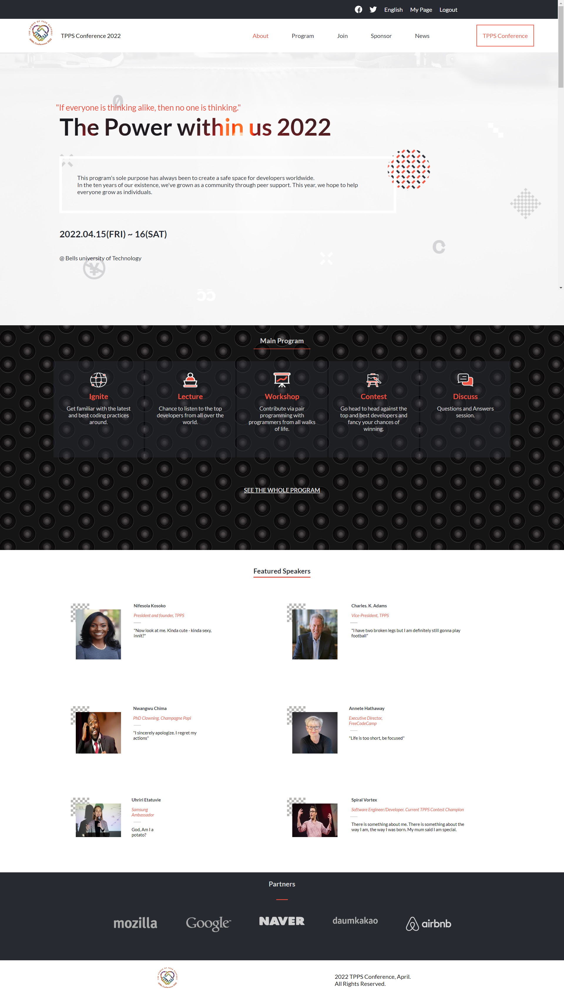
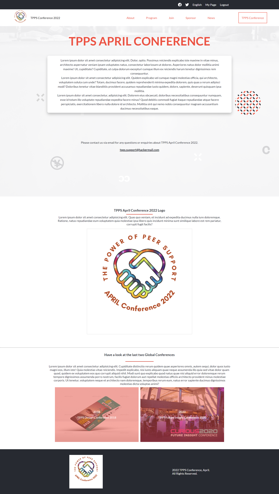

# TPPS Conference (Microverse captsone 1)

> This website (purely fictional) is to raise awareness for a developers' program aimed at supporting programmers all over the world.
- Homepage             

- About Page

## Built With

- HTML
- CSS
- Javascript
- Linters

## Live Demo

[Live Demo Link](https://cisco-the-wayword.github.io/TPPS-Conference/)

To get a local copy up and running follow these simple example steps.

### Prerequisites
- Git
- Github

### Install
- Clone the repo using: `git clone https://github.com/Cisco-the-wayword/Global-Summit.git`
- Go to index.html
- run the file

## Authors

👤 **Cisco-the-wayword**

- GitHub: [@Cisco-the-wayword](https://github.com/Cisco-the-wayword)
- Twitter: [@the_wayword1](https://twitter.com/the_wayword1)
- LinkedIn: [LinkedIn](https://www.linkedin.com/in/boluwatife-adegboyega-9397a81b3/)

## 🤝 Contributing

Contributions, issues, and feature requests are welcome!

## Show your support

Give a ⭐️ if you like this project!

## Acknowledgments

- Hat tip to anyone whose code was used
- The design was created by [Cindy Shins](https://www.behance.net/adagio07) on [Creative Commons](https://www.behance.net/gallery/29845175/CC-Global-Summit-2015)

## 📝 License

This project is [MIT](MIT.md) licensed.
